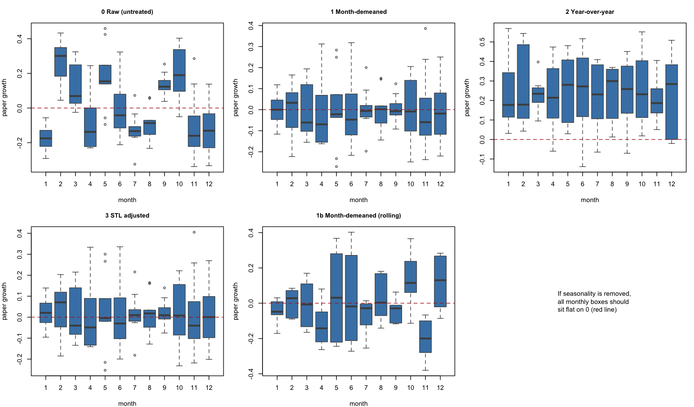
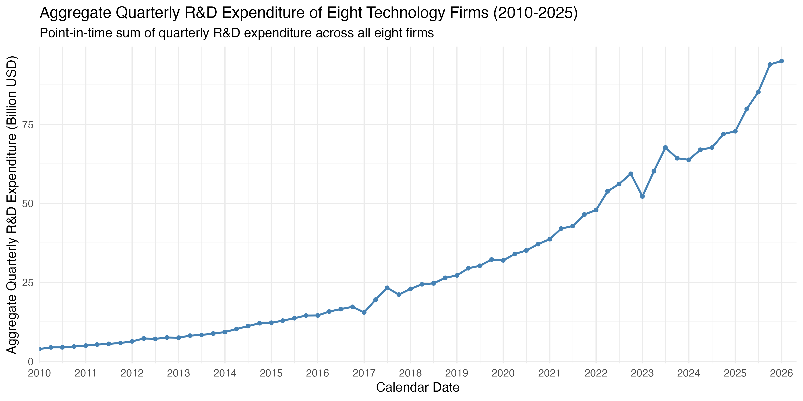
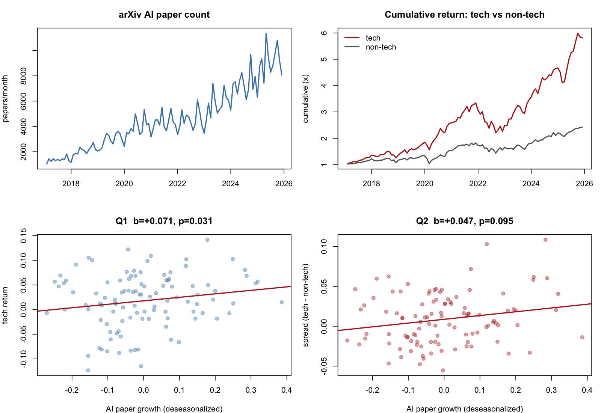
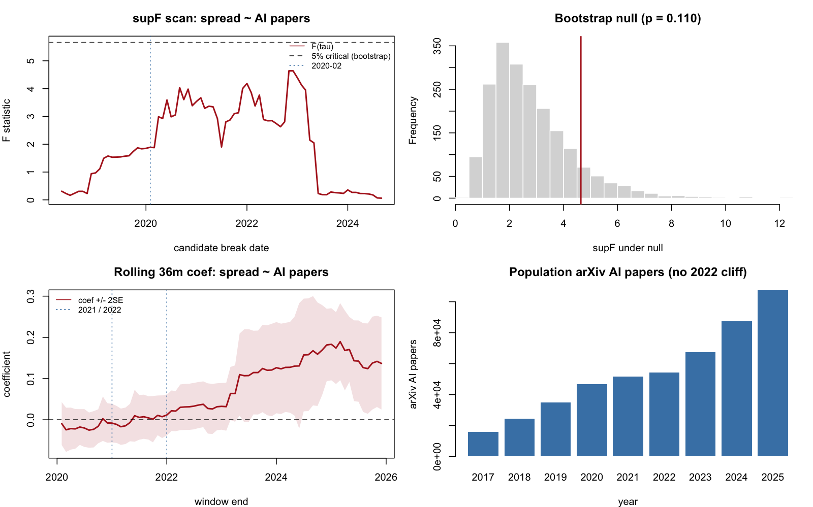
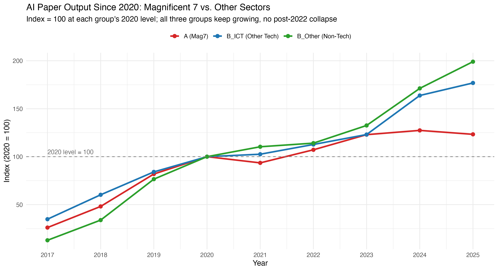

# From AI Research to Tech Stock Returns

Evidence from AI Paper Output, AI Patents, and U.S. Technology Stocks

## Motivation

Since 2017, AI research output has grown dramatically, alongside a remarkable boom in technology stocks. This raises an important question: does academic research output actually influence tech stock prices, or are the two merely coincident trends? This project investigates that question through time-series econometric analysis, while carefully addressing common methodological pitfalls, including spurious correlation, citation truncation bias, serial autocorrelation, multiple testing, and data-selection artifacts.

## Project Description

The project ran in **two generations**, and the disagreement between them is part of the result.

The **first generation** (Levels 0–4) regressed a hand-picked, value-weighted portfolio of nine mega-cap technology stocks on arXiv AI paper growth, using ADF tests, ARDL with Newey-West HAC errors, Granger causality, VAR / impulse responses, and firm-level Spearman correlations. It found essentially no aggregate effect, two marginal semiconductor-related signals, and a sharp post-2021 decline in corporate AI publications that it interpreted as a disclosure shift.

An audit of that design found a problem it could not fix from within: **a treatment group with no control group**. The nine-stock portfolio correlates 0.91 with the overall market, so a positive coefficient is equally consistent with a market-wide effect and a technology-specific one. The **second generation** therefore rebuilt the test on the CRSP full market — 15,979 firms — split into a technology and a non-technology group, and made the **spread between them** the dependent variable. A separate patent pipeline was built to test the first generation's disclosure-shift story against an independent data source.

Both generations are reported below. The first-generation code lives on the `archive/v1-level1-4` branch; `main` contains the second generation.

## Repository Structure

Five numbered pipelines. **The numbering is the dependency order**, and every script's paths are written relative to the repository root.

| Folder | What it does | Details |
|---|---|---|
| [`data/`](data/README.md) | Raw, non-reproducible inputs (CRSP+OpenAlex merged panel / arXiv / Compustat / SEC) | `data/README.md` |
| [`01_universe/`](01_universe/README.md) | CRSP full market → A/B_ICT/B_Other/C group panels | `01_universe/README.md` |
| [`02_returns/`](02_returns/README.md) | **Main line**: is the AI-research effect specific to technology stocks? | `02_returns/README.md` |
| [`03_patents/`](03_patents/README.md) | AI patent extraction and alignment for 268 listed firms | `03_patents/README.md` |
| [`04_rnd/`](04_rnd/README.md) | R&D expense for the eight target firms | `04_rnd/README.md` |
| [`05_panel/`](05_panel/README.md) | Firm-level panel: does a company's own papers/patents predict its own returns? | `05_panel/README.md` |

Everything under `data/` must be obtained from its original source; everything under each pipeline's `out/` can be rebuilt by re-running that pipeline.

## Data

| Source | Description | Range | Size |
|---|---|---|---|
| **CRSP + OpenAlex** (via WRDS, merged) | Full-market monthly stock file — returns, market cap, NAICS codes, and merged company AI-paper counts — for 15,979 firms | 2017-01 – 2025-12 | 297 MB |
| **arXiv metadata** | Monthly count of papers in AI categories (`cs.LG`, `cs.AI`, `cs.CL`, `cs.CV`, `cs.NE`, `stat.ML`) and their citation counts | 2017-01 – 2026-05 | 4.5 KB |
| **Google Patents Public Data** (BigQuery) | U.S. pre-grant publications for 268 firms, classified as AI by the WIPO 2019 search rules | 2010 – 2025 | 838,405 publications |
| **Compustat** | Annual (`xrd`) and quarterly (`xrdq`) R&D expense for the 8 target firms | 2010 – 2025 | 151 KB |
| **SEC EDGAR / XBRL** | Annual R&D expense for the 8 target firms, kept as a cross-check on Compustat | 2017 – 2025 | 9 KB |

The large CRSP+OpenAlex file is stored via Git LFS. See [`data/README.md`](data/README.md) for the per-file dependency map and two data traps that will silently corrupt results if missed (CRSP encodes missing NAICS as the integer `0`, not `NA`; CRSP split months contain duplicate rows). An earlier version of this file had a third trap — OpenAlex company papers systematically missing from 2022 onward — that has since been fixed at the source; see `data/README.md` for what changed.

#### AI papers by year

| Year | Papers | Citations |
|---|---|---|
| 2017 | 15,862 | 792,401 |
| 2019 | 35,040 | 869,116 |
| 2021 | 51,678 | 549,667 |
| 2023 | 67,488 | 347,380 |
| 2025 | 107,653 | 30,900 |

#### AI papers by subfield (2017–2026 total)

| Subfield | Total | Avg / month |
|---|---|---|
| Machine_Learning | 189,977 | 1,681 |
| Computer_Vision | 176,460 | 1,562 |
| LLM_NLP | 104,120 | 921 |
| General_AI | 45,361 | 401 |
| Robotics | 11,537 | 102 |
| Neural_Networks | 4,624 | 41 |

## Getting Started

Clone the repository with [Git LFS](https://git-lfs.com) installed, so the large CRSP+OpenAlex file downloads as real content rather than a pointer stub. Then open `ai-research-to-returns.Rproj` in RStudio. **The project file exists specifically to set the working directory to the repository root**, which every script assumes. Running a script with RStudio pointed one level deeper — at `02_returns/`, say — will fail to find `02_returns/scripts/00_common.R`.

```r
install.packages(c("data.table", "sandwich", "lmtest", "tidyverse", "lubridate", "plm"))
```

Then run the pipelines in numeric order. Each folder's README documents its own scripts, outputs, and caveats; the short version is:

```r
# 01 — build the group panels for the papers-trend figure (fast: just splits the v2 file)
source("01_universe/scripts/01_build_groups.R")
source("01_universe/scripts/02_plot_group_papers.R")

# 02 — the main analysis
source("02_returns/scripts/01_tech_classification.R", echo = TRUE)
source("02_returns/scripts/02_build_panel.R",         echo = TRUE)
source("02_returns/scripts/03_main_tests.R",          echo = TRUE)
source("02_returns/scripts/04_structural_change.R",   echo = TRUE)

# 04 — R&D expense figures
source("04_rnd/scripts/01_plot_rd.R")
```

The patent pipeline (`03_patents/`) is Python, uses its own virtual environment, and needs an authenticated Google Cloud account because it queries BigQuery through the `bq` CLI. Its outputs are committed, so it does not need to be re-run to read the results. See [`03_patents/README.md`](03_patents/README.md). The firm-level panel (`05_panel/`) is also Python for the merge step, then R for the tests — see [`05_panel/README.md`](05_panel/README.md).

Two things worth knowing on a first run. `02_build_panel.R` reads a 297 MB file and holds several GB in memory. `04_structural_change.R` takes a few minutes because it bootstraps 2,000 replications of a full breakpoint scan. Every script mirrors its console output into a diagnostics file under its `out/` folder, so every number quoted below can be traced back to a logged run.

## Analysis

### Method

The project uses monthly time-series econometrics to test whether AI research output predicts returns in AI-exposed U.S. technology stocks. To reduce spurious correlation, all specifications use log-differenced AI paper counts and month-end log returns, with HAC-robust standard errors and lagged terms.

| Level | Question | Methods |
|---|---|---|
| **L1 Portfolio** | Does aggregate AI research output predict returns of a value-weighted mega-cap technology portfolio? | ADF, ARDL + Newey-West HAC, Granger causality, VAR/IRF |
| **L2 Tech Sector Benchmark** | Do the same AI signals appear in the technology-sector portfolio specification? | ARDL + HAC, Granger causality, VAR/IRF |
| **L3 Subfield / Firm Pairs** | Do specific AI subfields predict returns of matched technology firms? | Pairwise ARDL, Granger causality, Panel FE with total AI growth control, VAR/IRF |
| **L4 Own-company Research Effect** | Does a firm's own AI research output predict its own stock returns? | Spearman correlation, firm case studies, R&D-expense comparison, VAR/IRF |
| **Q1 Full market** | Does AI research output move technology stocks, measured across all of CRSP? | ARDL + HAC, Benjamini-Hochberg correction across lags |
| **Q2 Tech-specificity** | Is that effect *specific* to technology stocks? | Tech − non-tech spread, size-quintile decomposition, Quandt-Andrews supF with bootstrapped critical values |
| **Q3 Firm panel** | Does a firm's own paper/patent activity predict its own return? | Firm + month fixed effects, firm-clustered robust SE (`05_panel`) |
| **P Patents** | Did firms substitute patents for papers after 2022? | WIPO 2019 AI classification of 838k pre-grant publications, CPC concordance, alignment against the paper series |

#### Subfield-to-firm mapping (Level 3)

| Subfield | Mapped tickers | Rationale |
|---|---|---|
| LLM_NLP | MSFT, GOOGL, GOOG, META, AMZN | LLM / cloud / search |
| Computer_Vision | NVDA, TSLA | Autonomous driving, visual acceleration |
| Robotics | NVDA, AVGO, TSLA | Hardware / automation |
| Machine_Learning | All 9 tickers | General ML |
| General_AI | MSFT, GOOGL, META, NVDA, AMZN | Broad AI leaders |
| Neural_Networks | NVDA, AVGO, GOOGL | Deep learning / chips |

#### Key methodological choices

- **Log returns from month-end to month-end.** Avoids the bias of within-month returns that drops the cross-month component.
- **Newey-West HAC standard errors.** Monthly financial regression residuals routinely show serial autocorrelation and heteroskedasticity.
- **Paper counts, not citations.** In this dataset citations are largely a proxy for paper *age*: 2017 papers average 54.3 citations, 2025 papers average 0.39, declining monotonically. Regressing returns on citation growth would manufacture a spurious downward trend. Citations are tested only on the 2017–2022 subsample, where every paper has had at least three years to accumulate them.
- **Deseasonalize X, not Y.** Conference submission deadlines account for 53.4% of the variance in AI paper growth (ANOVA F = 9.91, p = 9.6e-12), while returns show none (p = 0.279). The correction therefore belongs on the right-hand side. This is not cosmetic: untreated, the Q1 coefficient is +0.0023 (p = 0.926); month-demeaned, it is +0.0701 (p = 0.036).

  

  Each panel boxes AI paper growth by calendar month. If seasonality has been removed, every box should sit flat on the red zero line. The raw series (panel 0) clearly does not — February and October run high, January and April low. Month-demeaning and STL both flatten it; year-over-year differencing does not, and over-smooths the series besides.
- **Technology classification enumerated at the 6-digit NAICS level across four vintages.** CRSP re-codes firms as NAICS is revised — Software Publishers moved from 511210 to 513210 in 2022 — so a single-vintage rule silently drops software firms from the technology sector starting in 2023.
- **Value weights use the *prior* month's market cap.** Month-end market cap already contains that month's return, so weighting by it would hand the best performers a mechanically higher weight.
- **Multiple-testing correction.** Q1 and Q2 are each tested at four lags, so Benjamini-Hochberg is applied across them. A searched breakpoint is penalized by bootstrapping the Quandt-Andrews supF distribution rather than reporting the best date found.
- **Fiscal-period R&D alignment.** R&D expense is plotted over each firm's actual fiscal reporting period rather than forced into calendar years, which would incorrectly sum firms with different fiscal year-ends.

### Visualizations Used

Time-series trend plots show the long-run movement of AI paper counts, citation indicators, and firm-level stock prices. Scatter plots compare monthly AI paper growth with monthly returns after differencing, testing whether the apparent relationship survives the removal of shared time trends. VAR impulse-response plots trace the dynamic response of returns to shocks in AI research growth. Heatmaps summarize subfield-to-firm effects and firm-level Spearman correlations. The R&D-versus-papers comparison plot, and later the patent-versus-papers alignment, are used to test whether the post-2021 decline in visible AI publications reflects lower research investment, a disclosure shift, or a data artifact.

## Results

### First generation — Levels 0 to 4

> The figures for this section were never committed to the repository. The scripts and data that produced them are preserved on the `archive/v1-level1-4` branch, so they can be regenerated from there.

#### Level 0: a trend that looks suspicious

Plotted in levels, the relationship looks compelling: AI paper counts and the cumulative value-weighted market return both climb steadily through the decade, and a naive correlation would yield a strong positive coefficient. But two time-series that both trend upward will always look correlated, regardless of any actual causal link. This is the classic spurious regression problem (Granger & Newbold, 1974). The right test is whether changes in one predict changes in the other.

#### Levels 1 & 2 — aggregate effects are insignificant

Once we move from levels to first differences, the relationship collapses. The fitted line is essentially flat, the slope is statistically indistinguishable from zero, and the confidence band easily covers a horizontal line. The apparent co-movement in levels was almost entirely a shared time trend.

ARDL regressions with Newey-West HAC errors confirm the picture: across both the value-weighted market and the tech sector, no contemporaneous or lagged coefficient on AI paper growth reaches conventional significance, and R² stays below 0.08.

The VAR impulse response shows the only mild signal in the macro analysis: a positive bump at **month 2** (~+1.8%) following a one-SD shock to AI paper growth. The 95% bootstrap CI barely excludes zero at the peak and the response decays back to noise within 3–4 months. If there is an effect, it is delayed by about two months and short-lived.

#### Level 3 — semiconductor-related firms show the strongest exploratory signals

Of 27 subfield-by-firm pairs, only two reach `p < 0.10`, and both involve semiconductor stocks:

| Pair | Cumulative 4-month effect | p-value | Interpretation |
|---|---|---|---|
| **Machine_Learning × AVGO** | +0.404 | 0.091 | Broadcom benefits from general ML research heat |
| **General_AI × NVDA** | +0.193 | 0.068 | Nvidia benefits from broad AI research |
| Computer_Vision × NVDA | — | Granger p = 0.012 | CV research leads Nvidia returns |
| Robotics × AVGO | — | Granger p = 0.028 | Robotics research leads Broadcom returns |

The economic story is intuitive: **research activity translates into compute demand first**, so semiconductor suppliers capture the effect before software and platform firms. LLM_NLP — the subfield with the most public hype — shows uniformly small, insignificant effects. Note that these are 27 tests reported without multiple-testing correction; two results at `p < 0.10` is close to what chance alone would produce.

#### Level 4 — firm-level research output and stock performance

Across most large technology firms, AI publication output rose rapidly from 2017 to a peak around 2020–2021, then declined sharply beginning in 2022 despite the continued expansion of the AI industry. Alphabet, Microsoft, and Meta account for the majority of visible output in the earlier period.



R&D expense moves the other way: the combined R&D spending of the eight firms continues to rise throughout the same period, from roughly $3B to over $90B per quarter, with no inflection at 2021. (The sum is point-in-time — at each calendar date it adds only the firms whose fiscal quarter actually covers that date — because the eight firms have different fiscal year-ends.) The first generation read this divergence as a **disclosure shift** — firms kept spending but published less — and supported it with Movva et al. (2024), who found that Google, Microsoft, Amazon, and Meta together lost 6.3 percentage points of LLM arXiv publication share in 2023.

| Company | Pre-2023 LLM arXiv paper share | 2023 share | Change |
|---|---|---|---|
| Google | 6.7% | 3.8% | -2.9 pp |
| Microsoft | 6.8% | 5.4% | -1.4 pp |
| Amazon | 3.0% | 1.9% | -1.1 pp |
| Meta | 2.9% | 1.9% | -1.0 pp |
| Four-company total | 19.3% | 13.0% | -6.3 pp |

Annual Spearman correlations show substantial heterogeneity across firms: Microsoft and Apple are moderately positive between publication activity and returns, Alphabet consistently negative, and the rest mixed. The absence of a consistent sign suggests any relationship is highly firm-specific.

Firm-level impulse responses peak within one to two months and decay quickly, consistent with Levels 1–3: research output may carry some short-run information, but markets appear to incorporate it fast.

### The audit — what the first generation could not test

Two problems motivated a rebuild rather than an extension.

**No control group.** Levels 1–3 regress a mega-cap technology portfolio on AI paper growth. That portfolio correlates 0.91 with the overall market. If AI paper growth happened to be high in months when the whole market rose, a positive coefficient would appear even with no technology-specific channel at all. A treatment group without a control group cannot separate those two stories — and "AI research moves technology stocks *specifically*" is the claim the project is actually making.

**A broken industry flag.** The `is_ict` field shipped with the group panels used at the time misclassified firms in two independent ways, placing Alphabet, Meta, and Amazon in the *non*-technology group. Under that flag the non-technology group held 57.8% of all company AI papers, which would have inverted the meaning of any spread built from it. The rebuilt 6-digit, four-vintage classification put 83.4% of company AI papers in the technology group. (These specific percentages come from the CRSP panel this project used through August 2026, since retired in favor of a corrected source — see `data/README.md`. The corrected source's own classification is close to the rebuilt one, 75.9% vs. 74.1%, so the fix mattered mainly for the earlier panel, not for the current one.)

### Second generation — Q1 and Q2 on the CRSP full market

Sample: 2017-02 to 2025-12, 106 months after differencing; 716 technology and 7,809 non-technology firms per month on average. Q1's dependent variable is the value-weighted technology return; Q2's is the tech − non-tech spread, which removes the common market component.

| Series | Mean monthly | Annualized | SD |
|---|---|---|---|
| Tech (value-weighted) | 1.807% | 24.0% | 5.48% |
| Non-tech (value-weighted) | 0.930% | 11.7% | 4.48% |
| **Spread** | **0.877%** | **11.0%** | 3.18% |
| CRSP market | 1.156% | 14.8% | 4.59% |

The non-technology portfolio correlates 0.983 with the CRSP market index, confirming it behaves like the market — which is what makes it usable as a control.



The top row is the setup: AI paper counts grow steadily with strong monthly seasonality, and the technology portfolio outruns the non-technology one over the sample. The bottom row is the actual test, after both series are differenced and X is deseasonalized. Q1's slope is mildly positive; Q2's is flatter and its scatter is visibly noisier relative to the slope, which is the null the table below reports.

**Q1 — AI research and technology returns**

| Lag | Coefficient | HAC SE | t | p | BH-adjusted p |
|---|---|---|---|---|---|
| 0 | +0.0708 | 0.0324 | +2.18 | 0.031 | 0.062 |
| 1 | −0.0481 | 0.0339 | −1.42 | 0.159 | 0.212 |
| 2 | +0.0618 | 0.0282 | +2.19 | 0.031 | 0.062 |
| 3 | −0.0470 | 0.0377 | −1.24 | 0.216 | 0.216 |

The contemporaneous coefficient is significant at 5% on its own, but **0 of 4 lags survive BH correction**.

**Q2 — is the effect tech-specific?**

| Lag | Coefficient | HAC SE | t | p | BH-adjusted p |
|---|---|---|---|---|---|
| 0 | +0.0475 | 0.0282 | +1.69 | 0.095 | 0.190 |
| 1 | −0.0352 | 0.0196 | −1.80 | 0.075 | 0.190 |
| 2 | +0.0228 | 0.0179 | +1.28 | 0.205 | 0.273 |
| 3 | −0.0124 | 0.0244 | −0.51 | 0.614 | 0.614 |

**Not significant.** The control group makes this interpretable: the non-technology portfolio's own coefficient is +0.0233 (p = 0.519), a clean null. So Q2's insignificance is *not* the case where both groups respond and the difference cancels — the technology group's response simply is not strong enough to separate from zero at this sample size.

Splitting the market into size quintiles gives five positive coefficients of similar magnitude with no monotonic size pattern, so the gap between equal-weighted (+0.0591, p = 0.005) and value-weighted (+0.0475, p = 0.095) results is a **statistical power** difference, not evidence that the effect lives only in microcaps.

**A structural break, and a lesson about where break dates come from.** One deseasonalization variant truncates the sample to 2020-03 onward, and in that subsample Q2 is significant; imposing 2020-02 as a breakpoint gives an interaction p = 0.042. Scanning all 77 candidate dates and bootstrapping the Quandt-Andrews supF distribution gives p = 0.110 — not significant. Both computations are correct; the difference is entirely whether the date was chosen before or after looking at the data.



Top left: the supF scan never reaches the bootstrapped 5% critical value (dashed line), at any candidate date. Top right: the bootstrap null distribution, with the observed supF marked in red sitting well inside it. Bottom left: the rolling 36-month coefficient is flat around zero until windows ending in early 2023, then steps up and stays up — the pattern behind the pre-specified 2022 result below. Bottom right: the arXiv population series has no 2022 cliff, which is what keeps the Q1/Q2 tests clear of the company-paper data issue discussed further down.

A **pre-specified** 2022 split, by contrast, needs no such penalty, and it produces the most informative table in the project:

| Period | Tech | Non-tech | Spread |
|---|---|---|---|
| Before (n = 58) | +0.0397 (p = 0.231) | +0.0373 (p = 0.308) | **+0.0024 (p = 0.913)** |
| After (n = 48) | +0.1277 (p = 0.070) | −0.0054 (p = 0.942) | **+0.1331 (p = 0.012)** |

In the pre-period the two groups respond almost identically, so the spread is essentially exactly zero — a natural placebo that the design passes. In the post-period only the technology group moves. The rolling 36-month coefficient jumps in windows ending in early 2023, lining up with ChatGPT's release in 2022-11. **This is a lead, not a conclusion**: it survives every change of specification but not the removal of a single year or the three most extreme months.

### Independent check — patents

The first generation's disclosure-shift story has a stronger version: firms stopped publishing and *shifted to patents*. Patent data are independent of OpenAlex, so they can serve as an independent witness. The [`03_patents`](03_patents/README.md) pipeline classified 838,405 U.S. pre-grant publications from 268 firms using the WIPO 2019 AI search rules.

**No substitution appears — and there is no collapse to substitute for.** AI patent filings and company-attributed AI papers both grow steadily through the period:



Each group is indexed to its own 2020 level. The Magnificent 7 (red), other technology firms (blue), and non-technology firms (green) all keep climbing through 2025, with no post-2022 break in any of them.

| Year | arXiv population (monthly avg) | Company papers | Population YoY | Company YoY |
|---|---|---|---|---|
| 2020 | 3,888 | 10,471 | +33% | +23% |
| 2021 | 4,306 | 10,281 | +11% | −2% |
| 2022 | 4,513 | 11,466 | +5% | **+12%** |
| 2023 | 5,624 | 13,033 | +25% | +14% |

This table looked very different in an earlier version of this project. Through August 2026, the CRSP panel behind the company-paper numbers had a data-linkage bug — OpenAlex stopped attaching institutional affiliations to arXiv records from 2022 onward, and every firm's count halved in that single calendar year (GOOGL 654 → 101, MSFT 429 → 122, AMZN 182 → 49), which is the signature of a data break rather than independent corporate decisions. That panel has since been replaced by a corrected source (see `data/README.md`), and the artifact is gone. The conclusion does not depend on which version is read: neither the broken nor the fixed company-paper data shows firms cutting back on publishing after 2021/2022, so the "shifted to patents" story has nothing to explain in either version, and it is contradicted outright by the patent data regardless.

So the Level 4 interpretation needs splitting in two. Movva et al.'s finding of a genuine but modest decline in Big Tech's LLM publication *share* stands — it comes from a hand-curated corpus and is a share, not a level. But this project's own company-paper series shows no comparable decline once the OpenAlex linkage bug is corrected, and the "shifted to patents" version of the story is contradicted outright by the patent data either way. **The Q1 and Q2 tests were never affected by any of this**, because their independent variable is the arXiv population series, which never had a break.

## Conclusion

1. **Aggregate AI research output does not reliably predict market or technology-sector returns once shared trends are removed.** This held in the first generation's 9-stock portfolio and again in the full-market re-test.

2. **The effect is not shown to be technology-specific over the full sample.** Q2 gives +0.0475 (p = 0.095) with a clean null in the control group. Extending the cross-section from 9 mega-caps to 15,671 classified CRSP firms did not change the answer, and the size-quintile decomposition rules out the "effect only exists in small caps" explanation — so this null is hard to attribute to sample size.

3. **The strongest positive result is the post-2022 subsample** (+0.1331, p = 0.012), with a clean pre-period placebo and a control group that does not move. It is worth pursuing, but 48 months and sensitivity to dropping three observations mean it cannot carry a strong claim alone.

4. **A firm-level panel test tells the same story.** Regressing a company's own return on its own paper and patent counts, with firm and month fixed effects (so common market shocks are removed the same way Q2 removes them), gives another clean null — see [`05_panel`](05_panel/README.md).

5. **The post-2021 decline in visible corporate AI papers reported by an earlier version of this project was a measurement failure, not a disclosure decision.** A CRSP panel used through August 2026 had an OpenAlex institutional-affiliation linkage bug that produced a synchronized, spurious collapse in company paper counts; a corrected data source (see `data/README.md`) shows continuous growth instead. Patent data — independent of OpenAlex throughout — showed no substitution either way. **The Q1/Q2/panel results above are unaffected by this bug and its fix**, since none of them depend on company-level paper counts.

6. **The most methodologically instructive result is a contradiction.** The same data yield "significant" or "not significant" for the same break date depending only on whether the date was chosen before or after looking at the data. Reporting the imposed-breakpoint interaction instead of the bootstrapped supF would have been p-hacking, and would have been invisible to a reader.

### Where this could go next

The binding constraint is statistical power in the time dimension: detecting an effect of this size reliably in a monthly series would take roughly 300 months — 25 years — and the AI-paper series only begins in 2017. The time dimension is exhausted. A firm-level panel test using within-firm variation has already been run (`05_panel`) and is also a clean null. Further improvement would have to come from higher-frequency data (weekly returns against weekly submission counts) or from a cleaner measure of corporate AI activity than paper counts — R&D spend or patents, both already collected in this project.

## Contributors

| Contributor | Role | Responsibilities |
|---|---|---|
| Nai-Chia Chen | PM and writer | Data collection, analysis, coding, and writing for Levels 1–3. |
| Yan-Ru Chen | PM and writer | Data collection, analysis, coding, and writing for Level 4. |

## Acknowledgments

We would like to thank our instructor for providing valuable feedback, methodological guidance, and suggestions for improving the research direction of this project. We also gratefully acknowledge the maintainers and providers of the datasets used in this analysis, including the arXiv metadata dataset, OpenAlex, CRSP and Compustat via WRDS, Google Patents Public Data, and SEC EDGAR. Their data made this project possible.

## References

### Data Sources

Center for Research in Security Prices. (n.d.). *CRSP US stock databases* [Data set]. Wharton Research Data Services. https://wrds-www.wharton.upenn.edu/

Cornell University. (n.d.). *arXiv dataset* [Data set]. Kaggle. Retrieved June 26, 2026, from https://www.kaggle.com/datasets/Cornell-University/arxiv

Google. (n.d.). *Google Patents Public Data* [Data set]. BigQuery. https://console.cloud.google.com/marketplace/product/google_patents_public_datasets/google-patents-public-data

OpenAlex. (n.d.). *OpenAlex API documentation*. Retrieved June 26, 2026, from https://docs.openalex.org/

Priem, J., Piwowar, H., & Orr, R. (2022). *OpenAlex: A fully-open index of scholarly works, authors, venues, institutions, and concepts*. arXiv. https://arxiv.org/abs/2205.01833

S&P Global. (n.d.). *Compustat North America* [Data set]. Wharton Research Data Services. https://wrds-www.wharton.upenn.edu/

U.S. Securities and Exchange Commission. (n.d.). *EDGAR search tools*. Retrieved June 26, 2026, from https://www.sec.gov/search-filings

World Intellectual Property Organization. (2019). *WIPO technology trends 2019: Artificial intelligence*. https://www.wipo.int/publications/en/details.jsp?id=4386

### Cited Literature

Granger, C. W. J., & Newbold, P. (1974). Spurious regressions in econometrics. *Journal of Econometrics, 2*(2), 111–120. https://doi.org/10.1016/0304-4076(74)90034-7

Movva, R., Balachandar, S., Peng, K., Agostini, G., Garg, N., & Pierson, E. (2024). Topics, authors, and institutions in large language model research: Trends from 17K arXiv papers. In K. Duh, H. Gomez, & S. Bethard (Eds.), *Proceedings of the 2024 Conference of the North American Chapter of the Association for Computational Linguistics: Human Language Technologies (Volume 1: Long Papers)* (pp. 1223–1243). Association for Computational Linguistics. https://doi.org/10.18653/v1/2024.naacl-long.67

### Methodological References

Andrews, D. W. K. (1993). Tests for parameter instability and structural change with unknown change point. *Econometrica, 61*(4), 821–856. https://doi.org/10.2307/2951764 (Quandt-Andrews supF test)

Benjamini, Y., & Hochberg, Y. (1995). Controlling the false discovery rate: A practical and powerful approach to multiple testing. *Journal of the Royal Statistical Society: Series B, 57*(1), 289–300. https://doi.org/10.1111/j.2517-6161.1995.tb02031.x (multiple-testing correction)

Cleveland, R. B., Cleveland, W. S., McRae, J. E., & Terpenning, I. (1990). STL: A seasonal-trend decomposition procedure based on loess. *Journal of Official Statistics, 6*(1), 3–73. (STL deseasonalization)

Dickey, D. A., & Fuller, W. A. (1979). Distribution of the estimators for autoregressive time series with a unit root. *Journal of the American Statistical Association, 74*(366a), 427–431. https://doi.org/10.1080/01621459.1979.10482531 (ADF unit-root test)

Granger, C. W. J. (1969). Investigating causal relations by econometric models and cross-spectral methods. *Econometrica, 37*(3), 424–438. https://doi.org/10.2307/1912791 (Granger causality)

Newey, W. K., & West, K. D. (1987). A simple, positive semi-definite, heteroskedasticity and autocorrelation consistent covariance matrix. *Econometrica, 55*(3), 703–708. https://doi.org/10.2307/1913610 (Newey–West HAC standard errors)

Pesaran, M. H., Shin, Y., & Smith, R. J. (2001). Bounds testing approaches to the analysis of level relationships. *Journal of Applied Econometrics, 16*(3), 289–326. https://www.jstor.org/stable/2678547 (ARDL specification)

Sims, C. A. (1980). Macroeconomics and reality. *Econometrica, 48*(1), 1–48. https://doi.org/10.2307/1912017 (VAR / impulse response analysis)

Spearman, C. (1904). The proof and measurement of association between two things. *The American Journal of Psychology, 15*(1), 72–101. https://doi.org/10.2307/1412159

### Tools & Software

R and RStudio. R packages: `data.table`, `sandwich`, `lmtest`, `tidyverse`, `lubridate`, `ggplot2`. The archived first generation additionally used `tseries`, `forecast`, `plm`, `dynlm`, `vars`, `zoo`, `scales`, and `patchwork`.

Python 3.14 with `pandas`, `numpy`, and `requests`; BigQuery access through the `bq` CLI from the Google Cloud SDK (patent pipeline).
